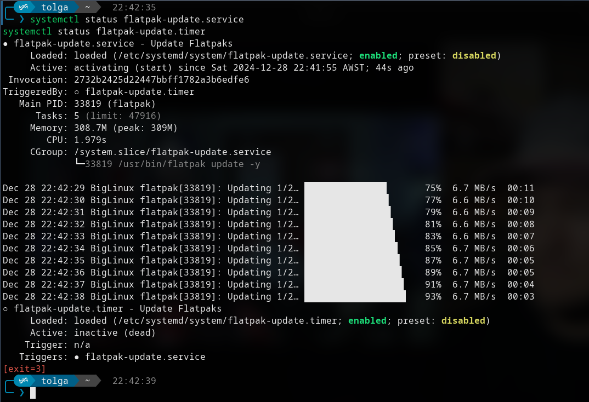
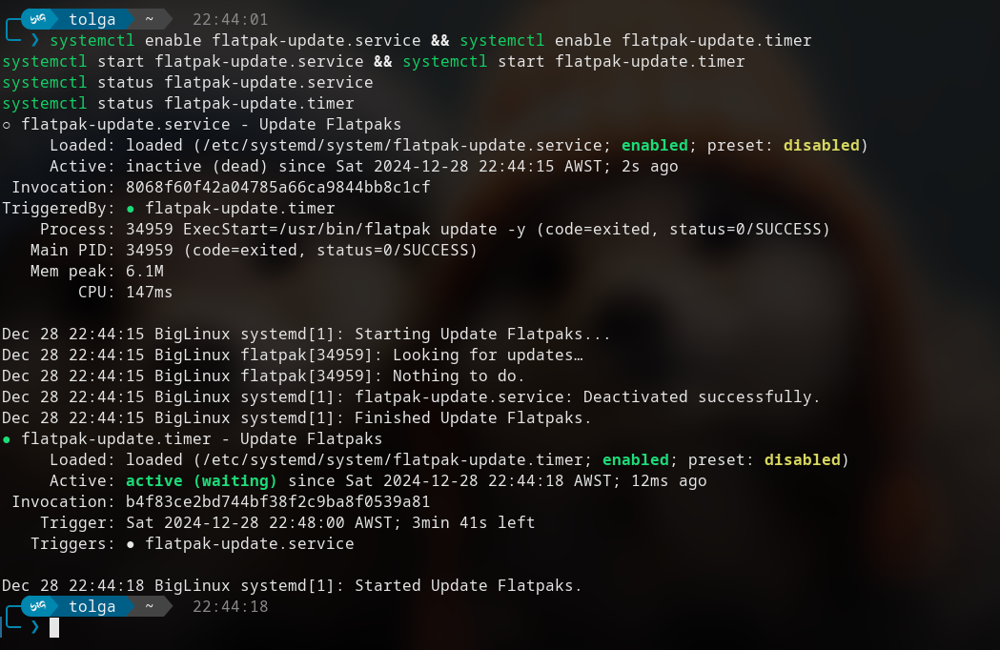
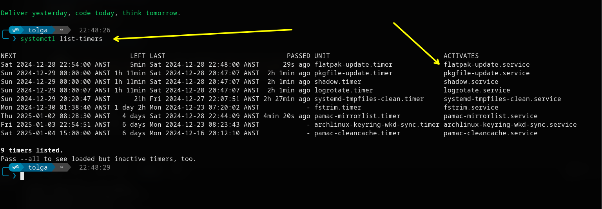

# My personal systemd flatpak updater

* Tolga Erok
* 24-2-24

## Create tolga-flatpak-update.service

location:

```bash
sudo nano /etc/systemd/system/tolga-flatpak-update.service
```

```bash
[Unit]
Description=Tolga's Flatpaks Updater
[Service]
Type=oneshot
ExecStart=/usr/bin/flatpak update -y
[Install]
WantedBy=default.target
```

### Create tolga-flatpak-update.timer

- `*:0/6` means it will run every 6 hours, starting from midnight.

location:

```bash
sudo nano /etc/systemd/system/tolga-flatpak-update.timer
```

```bash
[Unit]
Description=Tolga's Update Flatpaks Every 1hr
[Timer]
OnCalendar=*:0/6
Persistent=true
[Install]
WantedBy=timers.target
```

### Enable and start services

```bash
systemctl enable tolga-flatpak-update.service && systemctl enable tolga-flatpak-update.timer
systemctl start tolga-flatpak-update.service && systemctl start tolga-flatpak-update.timer
systemctl status tolga-flatpak-update.service
systemctl status tolga-flatpak-update.timer
```







# Script

```bash
#!/bin/bash
# My personal systemd flatpak updater
# Tolga Erok
# 24-2-24

# paths
SERVICE_PATH="/etc/systemd/system/tolga-flatpak-update.service"
TIMER_PATH="/etc/systemd/system/tolga-flatpak-update.timer"

# Create systemd service file's
echo "Creating systemd service..."
sudo bash -c "cat > $SERVICE_PATH" <<EOF
[Unit]
Description=Tolga's Flatpaks Updater

[Service]
Type=oneshot
ExecStart=/usr/bin/flatpak update -y

[Install]
WantedBy=default.target
EOF

# Create systemd timer file
echo "Creating systemd timer..."
sudo bash -c "cat > $TIMER_PATH" <<EOF
[Unit]
Description=Tolga's Update Flatpaks Every 1hr

[Timer]
OnCalendar=*:0/6
Persistent=true

[Install]
WantedBy=timers.target
EOF

# Reload systemd 
echo "Reloading systemd..."
sudo systemctl daemon-reload

# Enable and start service && timer
echo "Enabling and starting Tolga's Flatpak update service and timer..."
sudo systemctl enable tolga-flatpak-update.service
sudo systemctl enable tolga-flatpak-update.timer
sudo systemctl start tolga-flatpak-update.service
sudo systemctl start tolga-flatpak-update.timer

# Check both status
echo "Checking status of Flatpak update service and timer..."
sudo systemctl status tolga-flatpak-update.service --no-pager
sudo systemctl status tolga-flatpak-update.timer --no-pager

echo "My Flatpak auto-updater has been successfully configured!"


```