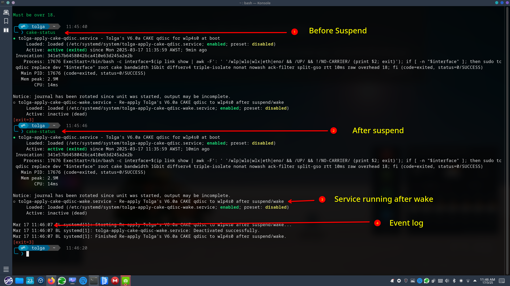
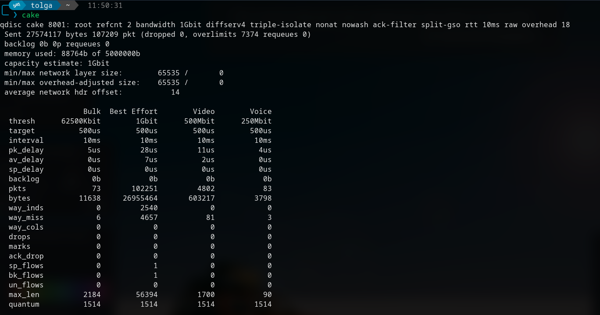
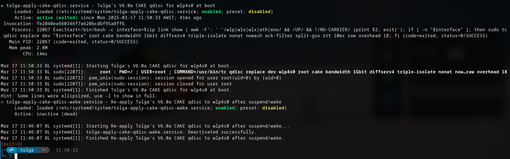

## CAKE queuing discipline, what my script Does

- *Tolga Erok*
- *17/3/2025*




*This script is all about  forcing the CAKE (Common Applications Kept Enhanced) queuing discipline (qdisc) onto your active network interface*  

###  Why? 
From my experience, CAKE can significantly improve network performance by reducing latency and managing traffic more efficiently. If you care about  lower ping times, smoother streaming, and better network responsiveness , this is a good tweak. I’ve found noticeable speed improvements in certain cases, especially on congested networks.   🚀

---

##  Breaking It Down 

1.  Detects Your Package Manager 
    - If you're using  Fedora , it uses `dnf`.  
    - If you're on  Arch/Manjaro , it goes with `pacman`.  
    - If neither, it just exits (because it assumes it's not supported).  

2.  Checks if `tc` (Traffic Control) is Installed 
    - If not found, it installs `iproute2`, which provides the `tc` command.  
    - This ensures the script works even if you’ve never installed these tools before.  

3.  Finds Your Active Network Interface 
    - It looks for the first available  wireless (wlp/wlo/wlx)interface that is UP and not in "NO-CARRIER" mode.  
    - If no wireless interface is found, it defaults to a wired interface that is active.  

    *To my understanding, this makes sure it always picks the  correct network interface dynamicallywithout needing to hardcode it.*  

4.  Creates Two Systemd Services 
    -  One runs at boot(`tolga-apply-cake-qdisc.service`).  
    -  One runs after suspend/wake(`tolga-apply-cake-qdisc-wake.service`).  

    - Both services apply CAKE to the detected interface with specific settings:
        - `bandwidth 1Gbit`
        - `diffserv4` (traffic priority rules)
        - `triple-isolate` (ensures fair bandwidth sharing)
        - `nonat` (helps for NAT traffic)
        - `ack-filter` (reduces TCP ACK overhead)
        - `split-gso` (better performance with large packet offloading)
        - `rtt 10ms` (estimated round-trip time)
        - `raw overhead 18` (overhead compensation)  

    *I believe these settings should optimize traffic shaping, reducing bufferbloat and improving latency.*

5.  Enables & Starts the Systemd Services 
    - `systemctl enable --now` makes sure they  run at boot and after waking from suspend. 
    
    *This means  you don’t have to manually reapply CAKE every time you restart* 

6.  Adds an Alias for Easy Status Checking 
   - The alias `cake-status` is added to `.bashrc`, so you can quickly check service status with:  
     
     ```bash
     cake-status
     ```

*I found this really handy to verify that CAKE is applied correctly.* 

---

##  Is it for You? 

I believe this script is a  solid way to automate CAKE QoS settingsfor your network without needing to manually set it each time. It dynamically detects your interface, applies the best traffic shaping settings, and ensures it stays persistent across reboots and wake-ups. From what I’ve seen, these tweaks can  help with gaming, video calls, and general network performance , especially if your connection suffers from high latency or congestion.  

If your interested, copy && paste the following link into your browser:

```bash
https://github.com/tolgaerok/tolga-scripts/blob/main/ARCH/BIGLINUX/NETWORKING/CAKE/cake-V6-0a.sh
```

#

 

