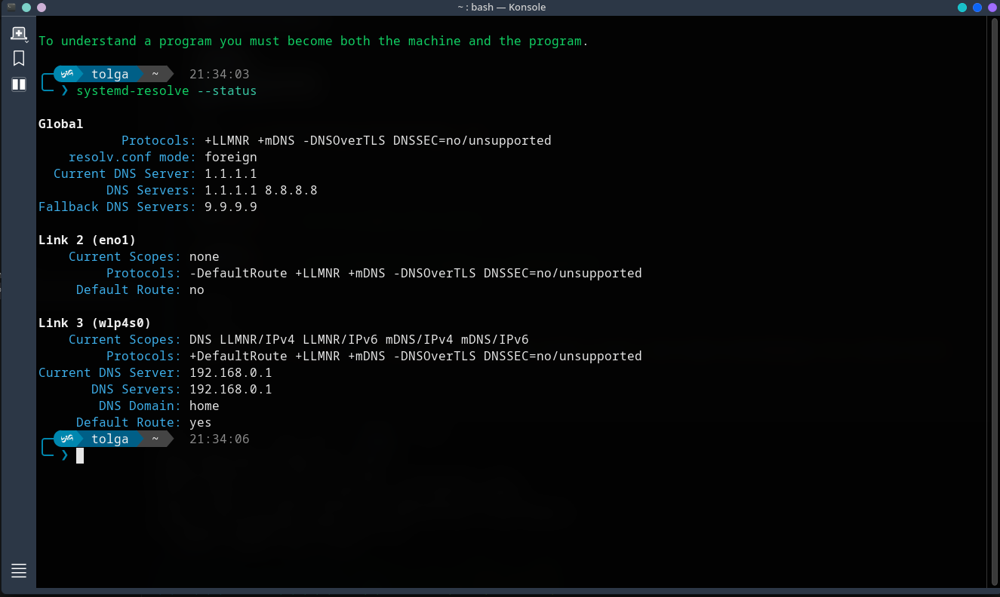

Edit: `/etc/systemd/resolved.config`

*Add to the bottom:*

```bash
[Resolve]
DNS=1.1.1.1 8.8.8.8
FallbackDNS=9.9.9.9
```

Edit: `/etc/NetworkManager/NetworkManager.conf`

*Add into:*

```bash
[main]
dns=none        # Use the /etc/systemd/resolved.config settings

[logging]
level=INFO      # Log informational messages for troubleshooting
```

*Then*

```bash
sudo systemctl enable --now systemd-resolved && sudo systemctl restart avahi-daemon NetworkManager smb systemd-resolved
```