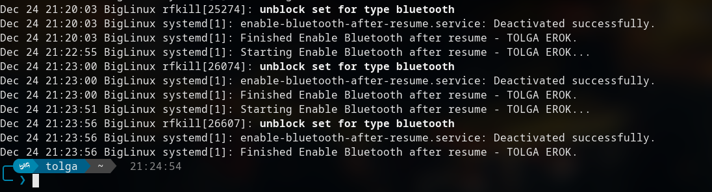
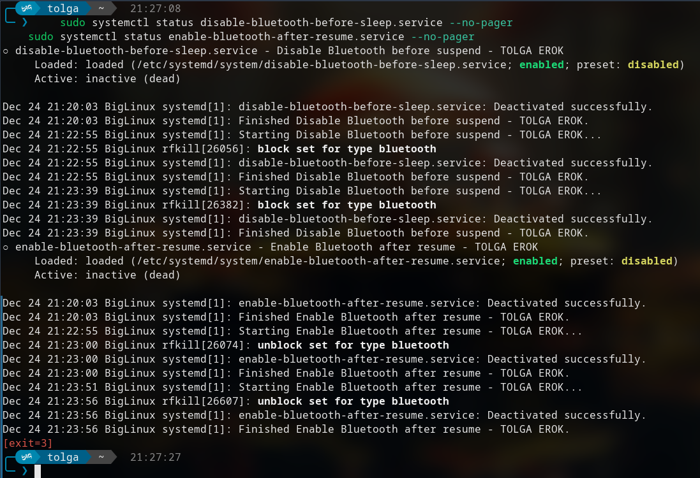

#  :wink: Turn bluetooth off when system suspends and turn back on after suspend

> *Tolga Erok* :wink:
>
> - 24/12/2024
> - *(c)* From my experience, this works great on manjaro and solusOS and made a small difference
>> to battery improvement.

## ***Pre-Suspend Service***

> - Create /etc/systemd/system/disable-bluetooth-before-sleep.service

``` js
[Unit]
Description=Disable Bluetooth and WiFi before suspend - TOLGA EROK
Before=sleep.target

[Service]
Type=oneshot
ExecStart=/usr/bin/rfkill block bluetooth ; nmcli radio wifi off

[Install]
WantedBy=sleep.target
```

## *Post-Resume Service*

> - Create /etc/systemd/system/enable-bluetooth-after-resume.service

``` js
[Unit]
Description=Enable Bluetooth and Wi-Fi after resume - TOLGA EROK
After=suspend.target

[Service]
Type=oneshot
ExecStartPre=/bin/sleep 5
ExecStart=/usr/sbin/rfkill unblock bluetooth ; nmcli radio wifi on


[Install]
WantedBy=suspend.target
```

## *Enable the Services*

> - Run the following commands:

``` js
sudo systemctl enable disable-bluetooth-before-sleep.service
sudo systemctl enable enable-bluetooth-after-resume.service
sudo systemctl start disable-bluetooth-before-sleep.service
sudo systemctl start enable-bluetooth-after-resume.service
echo 'alias blue="sudo systemctl status disable-bluetooth-before-sleep.service --no-pager || true && echo && sudo systemctl status enable-bluetooth-after-resume.service --no-pager || true"' >> ~/.bashrc
sudo systemctl daemon-reload
``` 

## *Test Suspend and Resume*

> - After enabling the services, suspend your system and resume it. Verify the status of Bluetooth with:

``` js
rfkill list bluetooth
```

##  :sunglasses: *Verify Logs*

> - Inspect the logs for each service to ensure they are triggered appropriately:

``` js
journalctl -u disable-bluetooth-before-sleep.service --no-pager
journalctl -u enable-bluetooth-after-resume.service --no-pager

sudo systemctl status disable-bluetooth-before-sleep.service --no-pager
sudo systemctl status enable-bluetooth-after-resume.service --no-pager
```

| Command | Output (Click to view) :yum: |
| :------ | ----------- |
| journalctl -u disable-bluetooth-before-sleep.service --no-pager &&  journalctl -u enable-bluetooth-after-resume.service --no-pager  |  |
| sudo systemctl status disable-bluetooth-before-sleep.service --no-pager && sudo systemctl status enable-bluetooth-after-resume.service --no-pager  |  |

