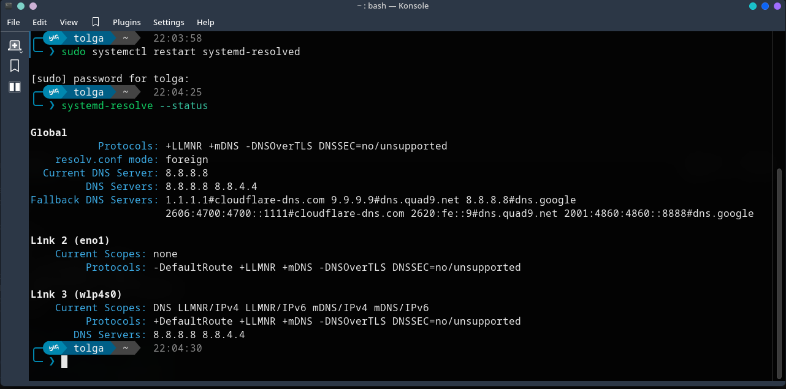

# systemD resolve
    sudo nano /etc/systemd/resolved.conf
    sudo systemctl restart systemd-resolved
    systemd-resolve --status

    


## Original biglinux
```bash
#  This file is part of systemd.
#
#  systemd is free software; you can redistribute it and/or modify it under the
#  terms of the GNU Lesser General Public License as published by the Free
#  Software Foundation; either version 2.1 of the License, or (at your option)
#  any later version.
#
# Entries in this file show the compile time defaults. Local configuration
# should be created by either modifying this file (or a copy of it placed in
# /etc/ if the original file is shipped in /usr/), or by creating "drop-ins" in
# the /etc/systemd/resolved.conf.d/ directory. The latter is generally
# recommended. Defaults can be restored by simply deleting the main
# configuration file and all drop-ins located in /etc/.
#
# Use 'systemd-analyze cat-config systemd/resolved.conf' to display the full config.
#
# See resolved.conf(5) for details.

[Resolve]
# Some examples of DNS servers which may be used for DNS= and FallbackDNS=:
# Cloudflare: 1.1.1.1#cloudflare-dns.com 1.0.0.1#cloudflare-dns.com 2606:4700:4700::1111#cloudflare-dns.com 2606:4700:4700::1001#cloudflare-dns.com
# Google:     8.8.8.8#dns.google 8.8.4.4#dns.google 2001:4860:4860::8888#dns.google 2001:4860:4860::8844#dns.google
# Quad9:      9.9.9.9#dns.quad9.net 149.112.112.112#dns.quad9.net 2620:fe::fe#dns.quad9.net 2620:fe::9#dns.quad9.net
#DNS=
#FallbackDNS=1.1.1.1#cloudflare-dns.com 9.9.9.9#dns.quad9.net 8.8.8.8#dns.google 2606:4700:4700::1111#cloudflare-dns.com 2620:fe::9#dns.quad9.net 2001:4860:4860::8888#dns.google
#Domains=
#DNSSEC=no
#DNSOverTLS=no
#MulticastDNS=yes
#LLMNR=yes
#Cache=yes
#CacheFromLocalhost=no
#DNSStubListener=yes
#DNSStubListenerExtra=
#ReadEtcHosts=yes
#ResolveUnicastSingleLabel=no
#StaleRetentionSec=0
```

# Network manger resolve config (ipv4)

    nmcli connection show

NAME                UUID                                  TYPE      DEVICE 
OPTUS_DADS_5GHz     2a20a2cd-15c5-40c3-92e1-a18c6251bf32  wifi      wlp4s0 
lo                  932397c3-d446-486b-83de-62602231abeb  loopback  lo     
OPTUS_B27161        e1dbab0d-05ce-4966-9307-c5bbc97f9ed7  wifi      --     
Wired connection 1  8d396ae6-a19a-36bc-bf83-b50f8a098c79  ethernet  --  

# ipv4

    sudo nmcli connection modify "OPTUS_DADS_5GHz" ipv4.dns "1.1.1.1 9.9.9.9 8.8.8.8"
    
# ipv6

    sudo nmcli connection modify "OPTUS_DADS_5GHz" ipv6.dns "2606:4700:4700::1111 2620:fe::9 2001:4860:4860::8888"
    
# Restart the Wi-Fi connection:

    sudo nmcli connection down "OPTUS_DADS_5GHz" && sudo nmcli connection up "OPTUS_DADS_5GHz"
    sudo systemctl restart NetworkManager

# Verify the DNS Configuration

    systemd-resolve --status

And check `/etc/resolv.conf`

    cat /etc/resolv.conf