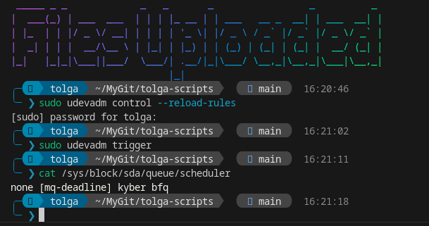

# Setting I/O Schedulers

Linux can get very slow during I/O intense applications however this can be improved by setting schedulers. NVMe Drives do not really benefit from this however we can create a config that alows us to automatically set NVMe Drives to `none` and set any SATA drives to run on `BFQ` we can do this by running

    sudo nano /etc/udev/rules.d/60-ioschedulers.rules

Once this new file is open just paste the following

```bash
# set scheduler for NVMe
ACTION=="add|change", KERNEL=="nvme[0-9]*", ATTR{queue/scheduler}="none"
# set scheduler for SSD and eMMC
ACTION=="add|change", KERNEL=="sd[a-z]|mmcblk[0-9]*", ATTR{queue/rotational}=="0", ATTR{queue/scheduler}="mq-deadline"
# set scheduler for rotating disks
ACTION=="add|change", KERNEL=="sd[a-z]", ATTR{queue/rotational}=="1", ATTR{queue/scheduler}="bfq"
```

Apply Changes Without Rebooting

- Reload Udev Rules:

        sudo udevadm control --reload-rules

- Trigger Udev Events:

        sudo udevadm trigger

- Verify the Scheduler: Check if the scheduler was applied to your devices:

        cat /sys/block/sda/queue/scheduler

Replace sdX with your device name `(e.g., sda, nvme0n1)`.



If you would like to run something like `mq-deadline` on your NVMe Drives by default then on the second like at the end in quotations where it says “none” replace none with `mq-deadline` and keep the quotations around it then we can save this file by pressing Control + X then y and enter.

# Trim timer

What the `fstrim.timer` Does

- The `fstrim.timer` automatically runs the fstrim command periodically (default is weekly).
- This helps to optimize SSD performance by freeing up unused blocks, allowing the SSD's controller to manage space more efficiently.

With this setup, your SSD will be regularly trimmed without manual intervention.

    sudo systemctl enable fstrim.timer
    sudo systemctl start fstrim.timer
    systemctl status fstrim.timer
    sudo fstrim -v /
