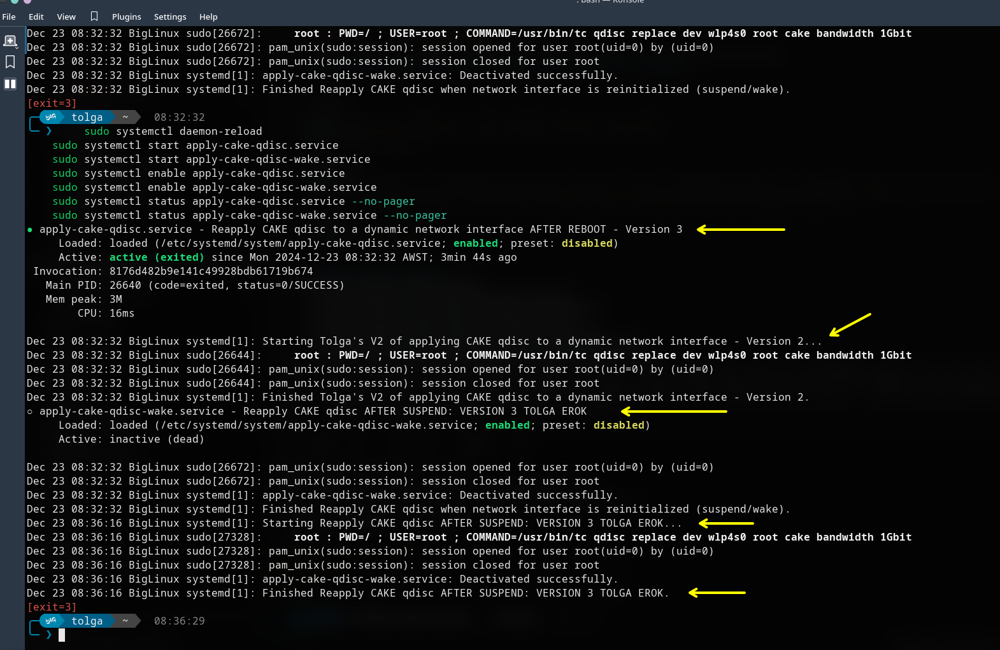
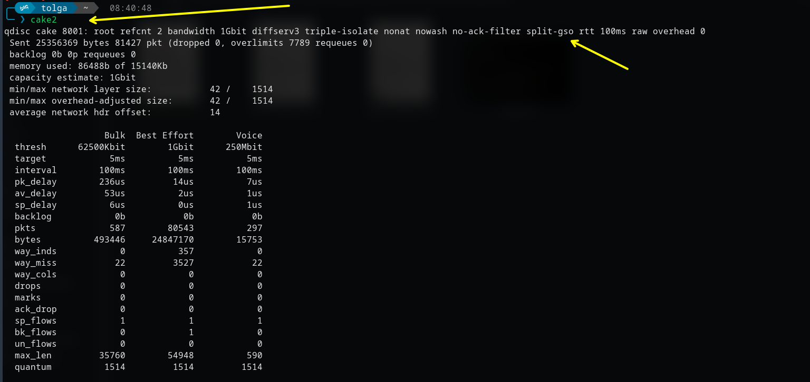
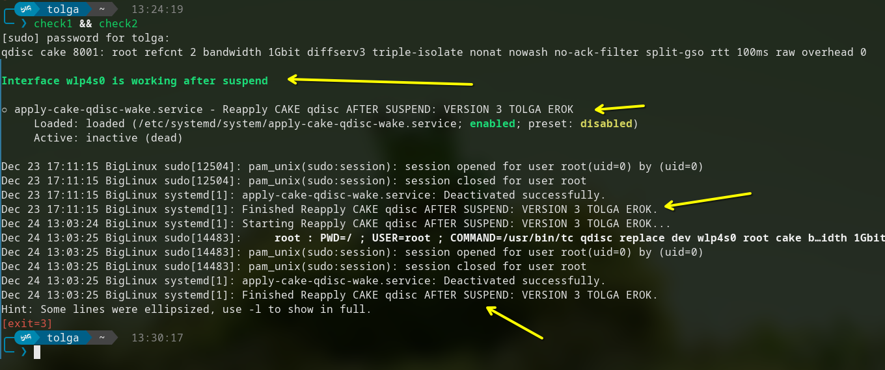

### Tolga Erok
    - network tweaks v5
    - 23/12/2024

## OVERVIEW


## ALIAS



## AFTER REBOOT AND SUSPEND




## Create service
    sudo nano /etc/systemd/system/apply-cake-qdisc.service


# Configuration for DYNAMIC CAKE systemd service on BOOT!

```bash
[Unit]
Description=Reapply CAKE qdisc to a dynamic network interface AFTER REBOOT - Version 3
After=network-online.target
Wants=network-online.target

[Service]
Type=oneshot
ExecStart=/bin/bash -c 'interface=$(ip link show | awk -F: '\''$0 ~ "wlp|wlo|wlx" && $0 !~ "NO-CARRIER" {gsub(/^[ \t]+|[ \t]+$/, "", $2); print $2; exit}'\''); if [ -n "$interface" ]; then sudo tc qdisc replace dev $interface root cake bandwidth 1Gbit; fi'
RemainAfterExit=yes

[Install]
WantedBy=multi-user.target
```

# Configuration for DYNAMIC CAKE systemd service after WAKE or SUSPEND!

    sudo nano /etc/systemd/system/apply-cake-qdisc-wake.service


```bash
[Unit]
Description=Reapply CAKE qdisc AFTER SUSPEND: VERSION 3 TOLGA EROK
After=suspend.target

[Service]
Type=oneshot
ExecStart=/bin/bash -c 'interface=$(ip link show | awk -F: '\''$0 ~ "wlp|wlo|wlx" && $0 !~ "NO-CARRIER" {gsub(/^[ \t]+|[ \t]+$/, "", $2); print $2; exit}'\''); if [ -n "$interface" ]; then sudo tc qdisc replace dev $interface root cake bandwidth 1Gbit; fi'

[Install]
WantedBy=suspend.target
```

# Enable and start service  
    sudo systemctl daemon-reload
    sudo systemctl start apply-cake-qdisc.service
    sudo systemctl start apply-cake-qdisc-wake.service
    sudo systemctl enable apply-cake-qdisc.service
    sudo systemctl enable apply-cake-qdisc-wake.service
    sudo systemctl status apply-cake-qdisc.service --no-pager
    sudo systemctl status apply-cake-qdisc-wake.service --no-pager
    echo "alias cake2='interface=\$(ip link show | awk -F: '\''\$0 ~ /wlp|wlo|wlx/ && \$0 !~ /NO-CARRIER/ {gsub(/^[ \t]+|[ \t]+$/, \"\", \$2); print \$2; exit}'\''); sudo systemctl daemon-reload && sudo systemctl restart apply-cake-qdisc.service && sudo systemctl restart apply-cake-qdisc-wake.service && sudo tc -s qdisc show dev \$interface && sudo systemctl status apply-cake-qdisc.service --no-pager && sudo systemctl status apply-cake-qdisc-wake.service --no-pager'" >> ~/.bashrc    
    echo "alias check1='interface=\$(ip link show | awk -F: \"\$0 ~ /wlp|wlo|wlx/ && \$0 !~ /NO-CARRIER/ {gsub(/^[ \\t]+|[ \\t]+$/, \"\", \$2); print \$2; exit}\"); sudo tc qdisc show dev \"\$interface\"'" >> ~/.bashrc
    echo "alias check2='~/check-interface.sh'" >> ~/.bashrc
   
# Make check-interface script
```bash
#!/usr/bin/env bash

# Metadata
# ----------------------------------------------------------------------------
# AUTHOR="Tolga Erok"
# VERSION="1"
# DATE_CREATED="23/12/2024"
# Description: Create script, make executable and echo into user bashrc.
# Purpose: To check if CAKE works after suspend.

# Configuration
# ----------------------------------------------------------------------------

# Write the check-interface.sh script
echo "#!/bin/bash

# Get the interface name
interface=\$(ip link show | awk -F: '\$0 ~ /wlp|wlo|wlx/ && \$0 !~ /NO-CARRIER/ {gsub(/^[ \\t]+|[ \\t]+$/, \"\", \$2); print \$2; exit}')

# Get the qdisc status for the interface
output=\$(sudo tc qdisc show dev \"\$interface\")

# Define color codes
GREEN=\"\033[1;32m\"
RED=\"\033[1;31m\"
RESET=\"\033[0m\"

# Check if 'cake' is present in the output
if echo \"\$output\" | grep -q 'cake'; then
    echo -e \"\\n\${GREEN}Interface \$interface is working after suspend\${RESET}\\n\"
else
    echo -e \"\\n\${RED}Interface \$interface did NOT work after suspend\${RESET}\\n\"
fi
sudo systemctl status apply-cake-qdisc-wake.service --no-pager
" > ~/check-interface.sh

# Make it executable
chmod +x ~/check-interface.sh

# Add alias to .bashrc
# echo 'alias check2="~/check-interface.sh"' >> ~/.bashrc
```

# Original
```bash
[Unit]
Description=KingTolga says: Apply CAKE qdisc to wlp4s0 - Version 1
After=network-online.target
Wants=network-online.target

[Service]
Type=oneshot
ExecStart=/sbin/tc qdisc replace dev wlp4s0 root cake bandwidth 1Gbit
RemainAfterExit=yes

[Install]
WantedBy=multi-user.target
```