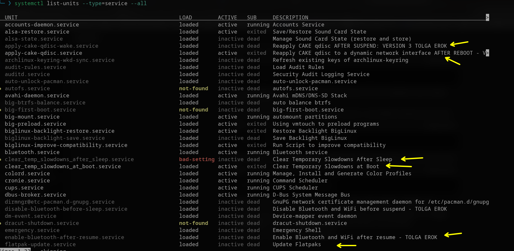
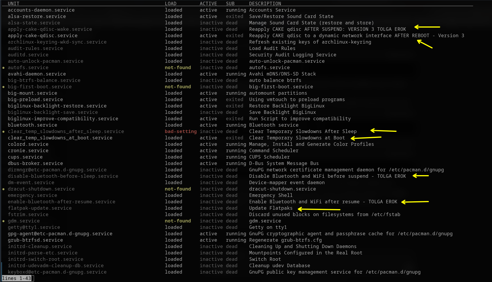
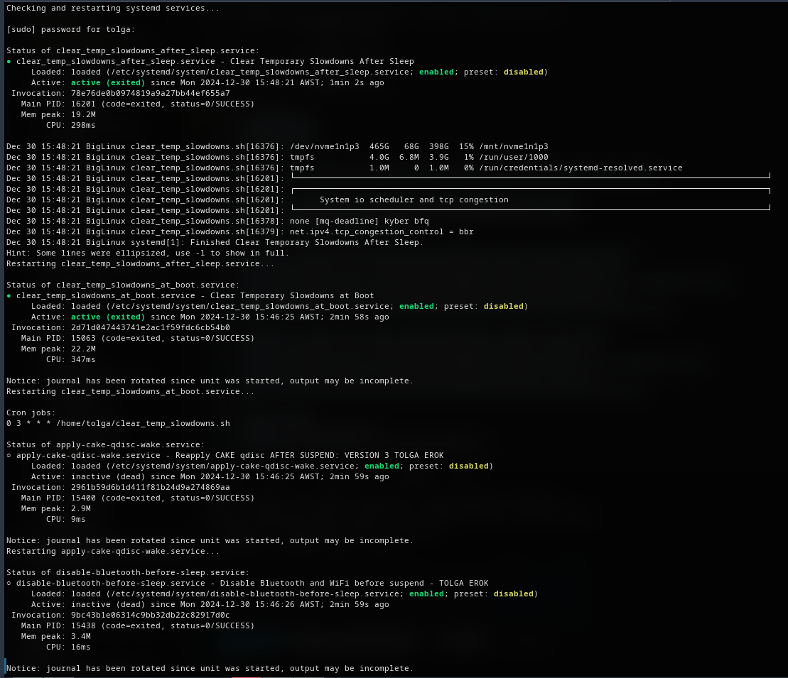

``` js
#!/bin/bash
# tolga erok
# 30/12/24

# Script to show and restart my custom systemd services and cron jobs

# Check systemd service status without pager and restart
echo -e "Checking and restarting systemd services...\n"
sudo systemctl daemon-reload

# Service status for clear_temp_slowdowns_after_sleep and restart
echo -e "\nStatus of clear_temp_slowdowns_after_sleep.service:"
sudo systemctl status clear_temp_slowdowns_after_sleep.service --no-pager || true
echo -e "Restarting clear_temp_slowdowns_after_sleep.service..."
sudo systemctl restart clear_temp_slowdowns_after_sleep.service || true

# Service status for clear_temp_slowdowns_at_boot and restart
echo -e "\nStatus of clear_temp_slowdowns_at_boot.service:"
sudo systemctl status clear_temp_slowdowns_at_boot.service --no-pager || true
echo -e "Restarting clear_temp_slowdowns_at_boot.service..."
sudo systemctl restart clear_temp_slowdowns_at_boot.service || true

# Cron jobs
echo -e "\nCron jobs:"
crontab -l || echo "No cron jobs found."

# Service status for apply-cake-qdisc-wake and restart
echo -e "\nStatus of apply-cake-qdisc-wake.service:"
sudo systemctl status apply-cake-qdisc-wake.service --no-pager || true
echo -e "Restarting apply-cake-qdisc-wake.service..."
sudo systemctl restart apply-cake-qdisc-wake.service || true

# Service status for disable-bluetooth-before-sleep and restart
echo -e "\nStatus of disable-bluetooth-before-sleep.service:"
sudo systemctl status disable-bluetooth-before-sleep.service --no-pager || true
echo -e "Restarting disable-bluetooth-before-sleep.service..."
sudo systemctl restart disable-bluetooth-before-sleep.service || true

# Service status for enable-bluetooth-after-resume and restart
echo -e "\nStatus of enable-bluetooth-after-resume.service:"
sudo systemctl status enable-bluetooth-after-resume.service --no-pager || true
echo -e "Restarting enable-bluetooth-after-resume.service..."
sudo systemctl restart enable-bluetooth-after-resume.service || true

# Service status for flatpak-update and restart
echo -e "\nStatus of flatpak-update.service:"
systemctl status flatpak-update.service --no-pager || true
echo -e "Restarting flatpak-update.service..."
sudo systemctl restart flatpak-update.service || true

# Timer status for flatpak-update.timer and restart
echo -e "\nStatus of flatpak-update.timer:"
systemctl status flatpak-update.timer --no-pager || true
echo -e "Restarting flatpak-update.timer..."
sudo systemctl restart flatpak-update.timer || true

# Restart systemd-resolved service and check its status
echo -e "\nRestarting systemd-resolved service..."
sudo systemctl restart systemd-resolved || true
echo -e "\nStatus of systemd-resolved:"
systemd-resolve --status || true

# Restart Samba and related services
echo -e "\nRestarting samba services..."
sudo systemctl restart smb.service || true
sudo systemctl restart nmb.service || true
sudo systemctl restart wsdd.service || true

echo -e "\nSystem status checks and restarts completed."


```

