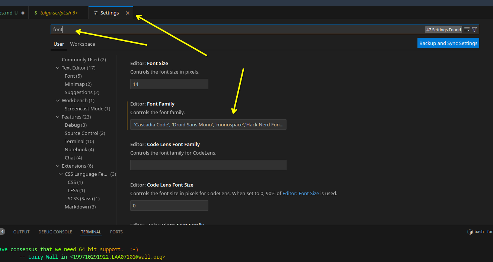
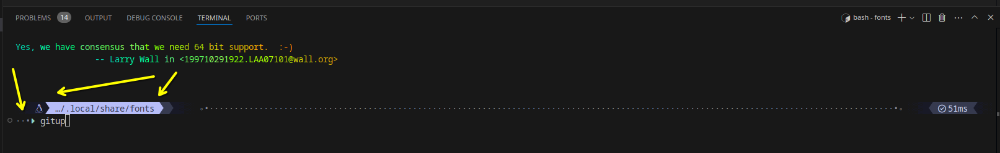

# My Nobara changes..
> Tolga
>
> 5/1/25

### Install better fonts for vs code and better fastfetch compatabilty for vscode



```js
mkdir -p ~/.local/share/fonts
ln -s ~/.local/share/fonts/ ~/.fonts
cd ~/.fonts
curl -OL https://github.com/ryanoasis/nerd-fonts/releases/latest/download/Hack.tar.xz
tar -xvf Hack.tar.xz

```

### Copy into vscode fonts setting
```js
 'Cascadia Code', 'Droid Sans Mono', 'monospace','Hack Nerd Font',monospace
 ```

 

 #